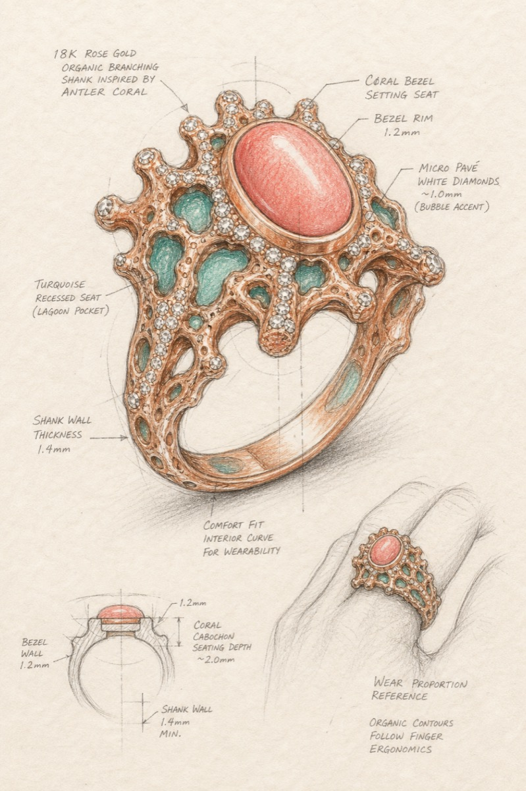
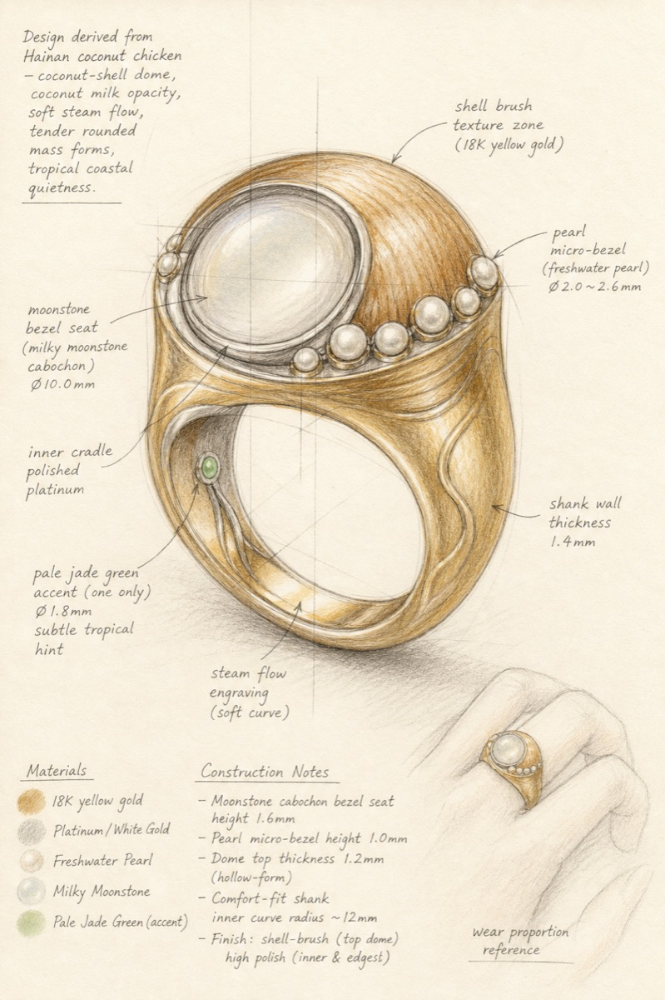
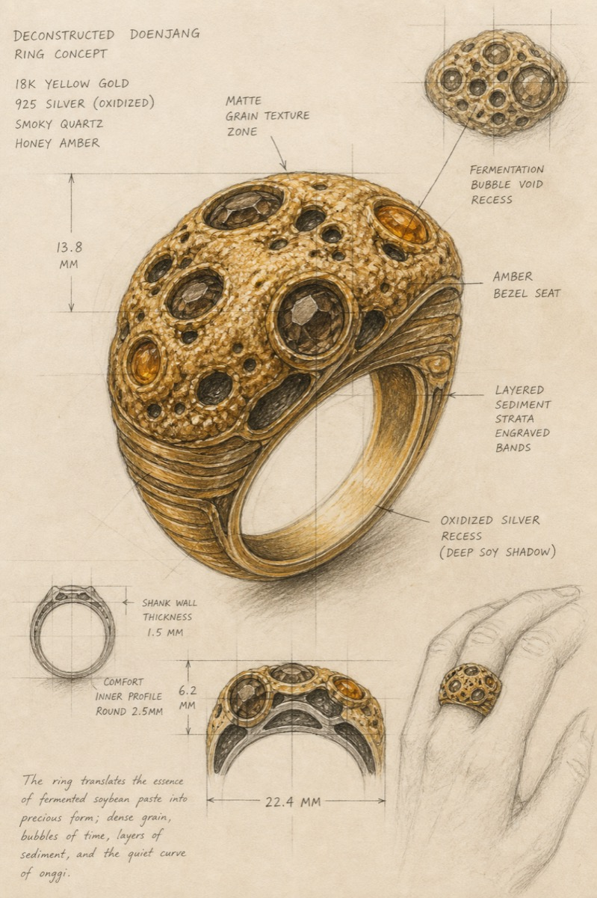
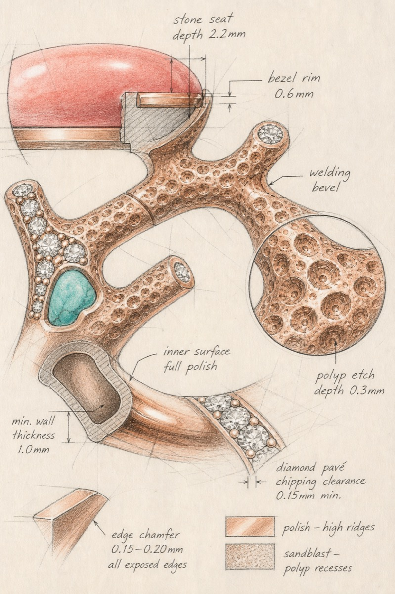
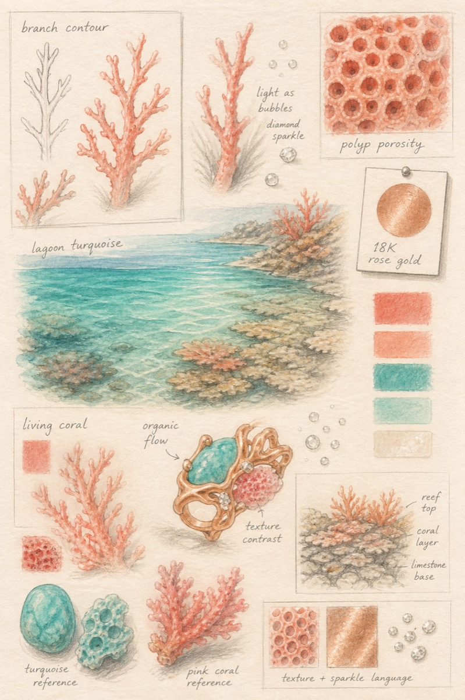
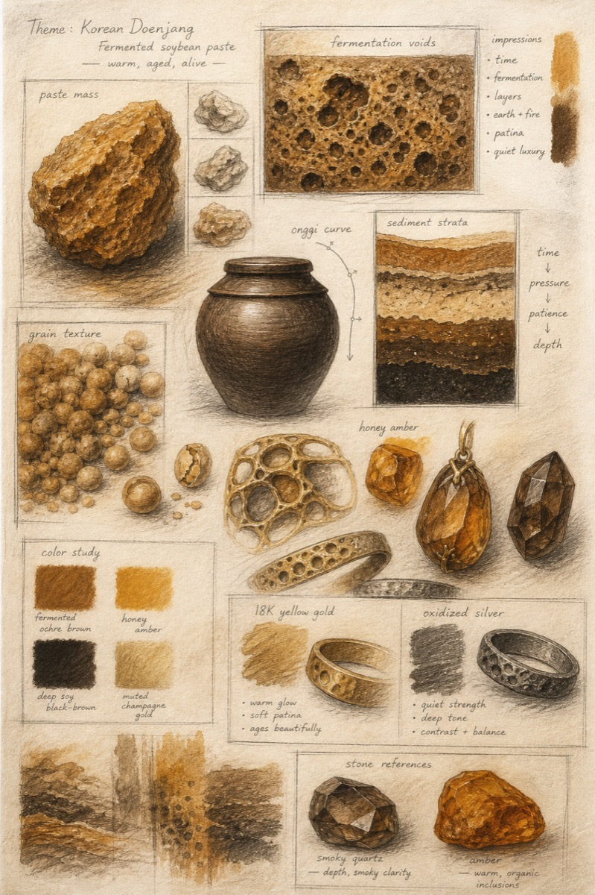

# ✨ High-End Jewelry Hand-Sketch

> **把「海南椰子鸡」画成高定戒指。**  
> 不是贴个卡通鸡腿 —— 是解构形态 / 材质 / 色彩 / 工艺，画成工坊能落地的手绘设计图。

[](./LICENSE)
[](./skill_config.yaml)
[](./SKILL.md)
[](https://github.com/Ictraeh/High-end-Jewelry-Hand-Sketch/issues)

**English:** A Cursor / agent skill that turns any free-form subject into a **3-piece high-jewelry atelier sketch set** — full design, craft close-up, mood board.

⭐ **If this made you smile (or made your jeweler nervous), star the repo** — it helps more oddball briefs find the bench.

---

## Gallery — yes, these started as food & reef

| Tropical Coral | Hainan Coconut Chicken | Korean Doenjang |
|:---:|:---:|:---:|
|  |  |  |

<details>
<summary>More frames (detail + mood)</summary>

| Coral detail | Coral mood | Doenjang mood |
|:---:|:---:|:---:|
|  |  |  |

</details>

> Samples © Ictraeh · generated with this skill · MIT. Full attribution → [`CREDITS.md`](./CREDITS.md)

---

## 60-second pitch

Most AI “jewelry” looks like a mall product photo.  
This skill forces the model to behave like a **stubborn atelier designer**:

1. **Deconstruct** the subject (form / material / color / craft)  
2. **Refuse** cartoon stickers & impossible thin metal  
3. Output **exactly three** hand sketches with paper grain, mm notes, and setting seats

Works for: rings, pendants, earrings, bracelets, brooches, hair ornaments, cufflinks.

---

## Install in Cursor

```bash
# Option A — clone into your personal skills folder
git clone https://github.com/Ictraeh/High-end-Jewelry-Hand-Sketch.git \
  ~/.cursor/skills/high-end-jewelry-hand-sketch
```

```text
# Option B — paste in chat
https://github.com/Ictraeh/High-end-Jewelry-Hand-Sketch
用这个 skill 给我一个戒指设计图，主题：______
```

Then say something unhinged and delicious:

```text
主题：海南椰子鸡
jewelry_type: ring
```

---

## What you get (always ×3)

| # | Output | Why it exists |
|---|--------|---------------|
| 1 | **Full design drawing** | 45° form + wear-scale + wall-thickness notes |
| 2 | **Craft detail close-up** | Bezel seats, welding bevels, polish zones |
| 3 | **Mood-reference board** | Form / texture / color chips — no fake product shot |

Prompts live in [`prompts/`](./prompts/). Config: [`skill_config.yaml`](./skill_config.yaml). Agent instructions: [`SKILL.md`](./SKILL.md).

---

## Try these viral prompts 🌶️

Copy → paste → tag us / open an Issue with your result:

```text
主题：热带珊瑚 —— 分枝、多孔虫杯、潟湖色，避免卡通水族箱
主题：韩国大酱 —— 酱体团块、发酵气孔、甕器曲线，避免食物摆盘
主题：海南椰子鸡 —— 椰壳穹顶、椰奶乳浊、蒸汽曲线，避免整鸡卡通
主题：深夜便利店关东煮 —— 竹签阵列、汤面蒸汽、暖黄灯色
主题：敦煌壁画飞天飘带 —— 飘带曲线、矿物颜料层、敦煌沙金
主题：老式收音机旋钮 —— 刻度环、旋钮齿纹、暖琥珀指示灯
```

Starter themes: `热带珊瑚` · `韩国大酱` · `海南椰子鸡` · `关东煮` · `敦煌飞天` · `收音机旋钮`

**Share rule:** post your 3 images + deconstruction table in [Discussions / Issues](https://github.com/Ictraeh/High-end-Jewelry-Hand-Sketch/issues/new) with title `[Showcase] your-theme`. Best ones get pinned in the README.

---

## Deconstruction cheat-sheet

| Lens | Question the skill asks |
|------|-------------------------|
| Form | What curves / voids / layers can become metal geometry? |
| Material | What technique carries the tactile feel (enamel? hammer? pavé?) |
| Color | Palette locked — one accent color max |
| Craft | Can a bench actually cast, set, and polish this? |

Worked examples: [`examples/`](./examples/).

---

## License · Credits · Brand notes

- **Code & prompts & docs & showcase samples:** [MIT](./LICENSE) © 2026 Ictraeh  
- **Hand-drawing grammar sources + maison aesthetic references:** [`CREDITS.md`](./CREDITS.md)  
- Brand names (Cartier, Buccellati, Van Cleef & Arpels, …) are **style north stars only** — no affiliation, no endorsement, no “official” claim.

---

## Roadmap / 引流合作

- [ ] Community showcase wall (PR your weirdest ring)  
- [ ] More jewelry types preset packs (brooch / hair ornament)  
- [ ] Bilingual prompt packs (ZH / EN / KR)  
- [ ] Collab with ateliers & creators — open an Issue with `collab`

Built something cool with this skill?  
**Star ⭐ · Fork · Share** — or just yell your theme in Issues. The stranger the brief, the better the sketch.

---

<p align="center">
  <sub>From reef to doenjang to coconut chicken — if it has a silhouette, it can wear gold.</sub>
</p>
